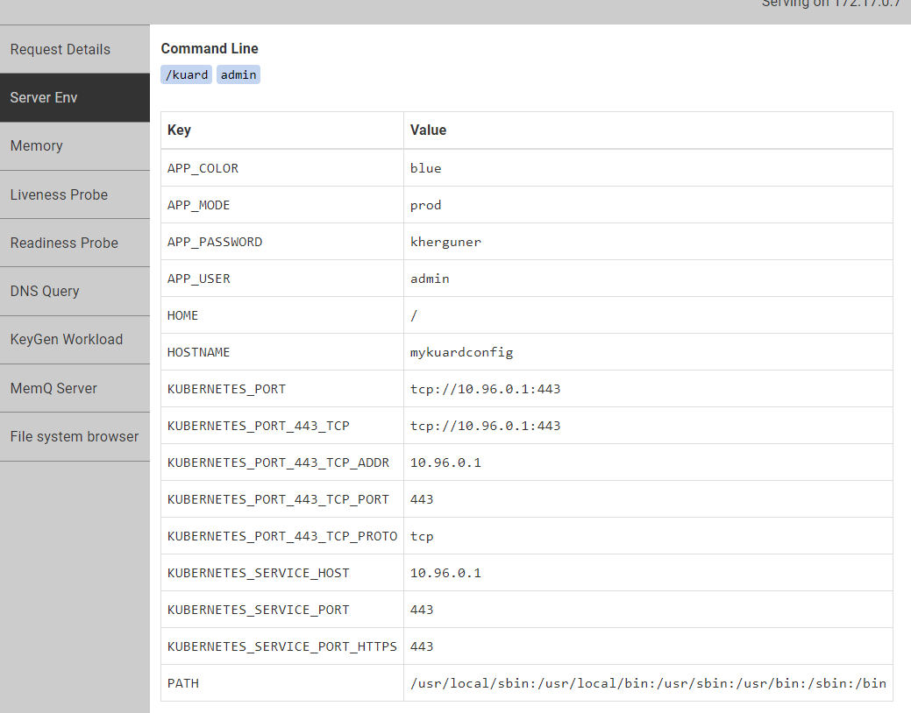

# Kubernetes config map via minikube

First step

>kubectl get pod -w --show-labels

>kubectl get rd -w

>kubectl get service -w
    
it's ready to deploy! :point_down:

**How can ı deploy nginx project on minikube**
- [x] kubectl create -f kuard-config.yaml

- [x] kubectl create -f kuard-pod.yaml

- [x] kubectl create -f kuard-ingress.yaml

**How can ı generate url**
- [x] minikube ip | kuard.info.cm--> "C:\Windows\System32\drivers\etc\hosts"

You can see dashboard via browser @octocat :+1: