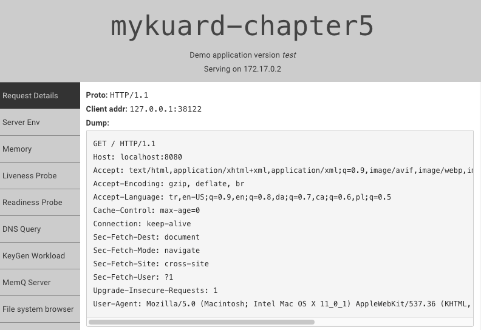

# Kubernetes kuard pod create via minikube

------------------------------------------------------------------------
```
cd pod-volumes
You have to file path "/home/docker/pod-volume" via worker node 
```

**How can ı deploy on minikube**
- [x] kubectl apply -f pv.yaml

- [x] kubectl apply -f pvc.yaml

- [x] kubectl apply -f kuard-pod.yaml

- [x] kubectl get pods -w to new terminal

- [x] kubectl expose pod mykuard-chapter5

- [x] kubectl port-forward mykuard-chapter5 8080:8080

- [x] http://localhost:8080/

## You can see dashboard via browser


